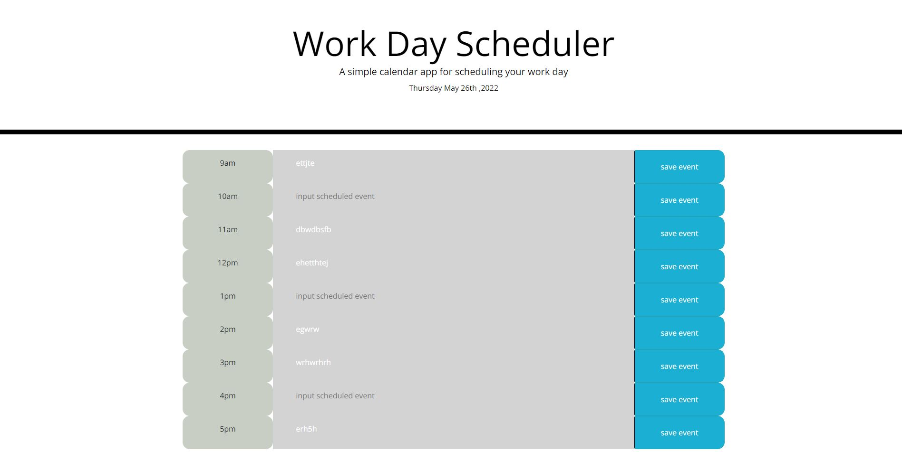

# work-day-scheduler

## features
- stores event information with corresponding time
- if page is refreshed, data is preserved
- color coded with the current time to keep the schedule on track vidually

[schedule-site](https://samb56.github.io/work-day-scheduler/)

